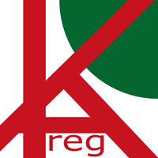
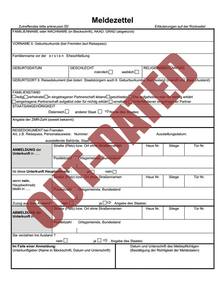

<h1>KAreg Meldezettel App</h1>

The KAreg Meldezettel App provides an easy way to inform the austrian authorities about your relocation.

<h2>Tired of all the bureaucratic paper work when changing your residence?</h2>

<b>Not any longer with the KAreg Meldezettel App!</b>

<h2>Why?</h2>

When moving to Austria or changing the place of your residence you are legally bound to inform two austrian authoritys of your relocation. First the municipal office of your old city, which is called "Abmelden", second the municipal office of your new city which is called "Anmelden. The deadline to do this is <b>only three days</b> from the day you move into your new accomodation! We help you save time by providing an easy way to do so.

<h2>Getting started - Its easy!</h2>

Just enter your data digitally. Wherever, whenever you want

Screenshots

<h1>Prerequisites</h1>

Text

<h1>FAQ</h1>

<b>ATTENTION! This App was developed for a project at Fachhochschule Joanneum Graz. It does not actually send your data to the austrian authoritys, but only saves it locally on your device!</b>

<h4>Frage</h4>

Text

HINWEIS das Daten nicht tatsächlich abgeschickt werden
Can man sich auch abmelden

<h1>LICENCE</h1>

You can find the license at <a href="LICENSE.txt">LICENSE.txt</a>.

<h1>Contributors</h1>

Text

<h1>Releases</h1>

Text

